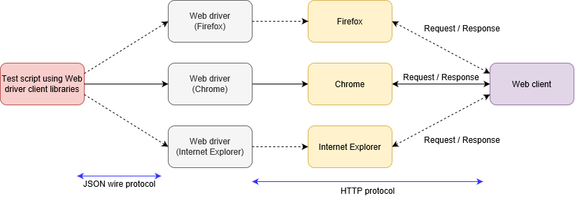
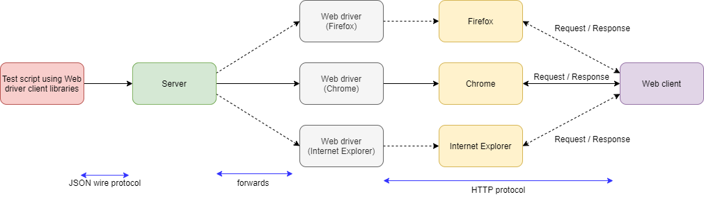
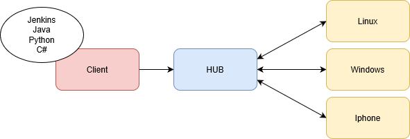

# **Selenium Remote WebDriver**

### ``Introduction``

What is a Selenium WebDriver:

Selenium WebDriver is a tool used to execute automated test cases on various browsers.

What is a Selenium RemoteWebDriver:

RemoteWebDriver class implements the WebDriver interface to execute test scripts through the RemoteWebDriver server on a remote machine.

### ``RemoteWebDriver consists of a server and a client.``

The server is a component that listens on a port for various requests from a RemoteWebDriver client.
Once the request is received, it forwards the request to the browser driver: FirefoxDriver, IEDriver, or ChromeDriver.

The client libraries serve as a RemoteWebDriver client.
The client translates test script requests to JSON payload and sends it across to the RemoteWebDriver server using the JSON wire protocol.



When test cases are executed, the WebDriver client libraries link with the browser drivers directly.
On the other hand, if one tries to execute tests remotely, the WebDriver client libraries communicate with the RemoteWebDriver server.
Then, the server links to either of the browser drivers the WebDriver client requests for.



### ``Setup Selenium RemoteWebDriver environment``

### *Download Selenium Grid*



### *launch Hub:*

``java -jar selenium-server-standalone-3.141.59.jar -role hub``

### *register Node:*

``java -jar selenium-server-standalone-3.141.59.jar -role node -hub https://xxx.xxx.xxx.xxx:4444/grid/register``

### *look up in grid console : http://xxx.xxx.xxx.xxx:4444/grid/console*

```
from selenium import webdriver
from selenium.webdriver.common.desired_capabilities import DesiredCapabilities
from selenium.webdriver.remote.remote_connection import RemoteConnection
```
```
    @keyword('Open Google At Remote Side Using Chrome')
    def open_google_at_remote_side_using_chrome(self):
        RemoteConnection.set_timeout(20)
        self.driver = webdriver.Remote(command_executor='http://xxx.xxx.xxx.xxx:4444/wd/hub',
                                       desired_capabilities={"browserName": "chrome", "platformName": "Windows 8"})
        self.driver.get("https://www.google.com.tw/")
    
    @keyword('Google Page Should Be Shown At Remote Side')
    def google_page_should_be_shown_at_remote_side(self, locator, timeout=3):
        wait_element_is_load(self.driver, locator, timeout)
    
    def wait_element_is_load(driver, locator, timeout):
    try:
        WebDriverWait(driver, timeout).until(EC.presence_of_element_located((By.XPATH, locator)))
        WebDriverWait(driver, timeout).until(EC.visibility_of_element_located((By.XPATH, locator)))
    except:
        driver.save_screenshot('./out/remote_fail.png')
        raise Exception('{} not found'.format(locator))
```
```
*** Test Cases ***
Remote Driver Test
    Open Google At Remote Side Using Chrome
    Google Page Should Be Shown At Remote Side    //*[@class='ctr-p']
    [Teardown]    Close Remote Side Browser
```

### ``Conclusion``

Pros: Parallel testing in various OS or browser, and can also combine with CI.

Cons: Hub and Node need to be taken care of.

### ``Reference``

Selenium Grid Tutorial : https://www.browserstack.com/guide/selenium-grid-tutorial

Selenium remotewebdriver - Difference between webdriver and remotewebdriver : https://www.browserstack.com/guide/difference-between-selenium-remotewebdriver-and-webdriver
